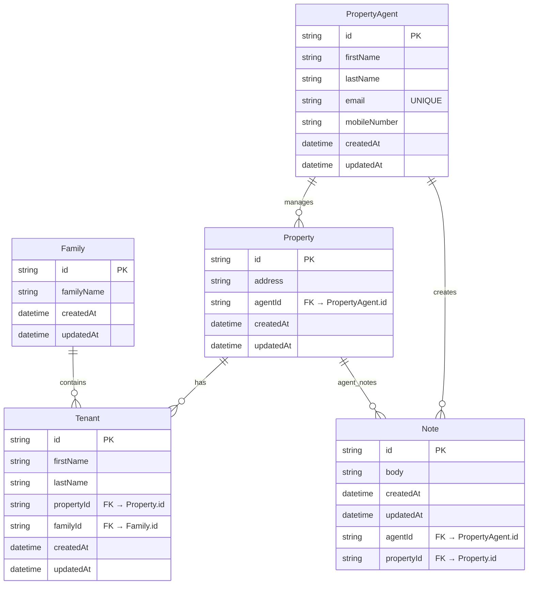

# Entity Relationship Diagram - Property Agent

```mermaid
erDiagram
    PropertyAgent {
        string id "PK"
        string firstName
        string lastName
        string email "UNIQUE"
        string mobileNumber
        datetime createdAt
        datetime updatedAt
    }

    Property {
        string id "PK"
        string address
        string agentId "FK → PropertyAgent.id"
        datetime createdAt
        datetime updatedAt
    }

    Tenant {
        string id "PK"
        string firstName
        string lastName
        string propertyId "FK → Property.id"
        string familyId "FK → Family.id"
        datetime createdAt
        datetime updatedAt
    }

    Family {
        string id "PK"
        string familyName
        datetime createdAt
        datetime updatedAt
    }

    Note {
        string id "PK"
        string body
        datetime createdAt
        datetime updatedAt
        string agentId "FK → PropertyAgent.id"
        string propertyId "FK → Property.id"
    }

    PropertyAgent ||--o{ Property : "manages"
    Property ||--o{ Tenant : "has"
    Family ||--o{ Tenant : "contains"
    PropertyAgent ||--o{ Note : "creates"
    Property ||--o{ Note : "agent_notes"
```
